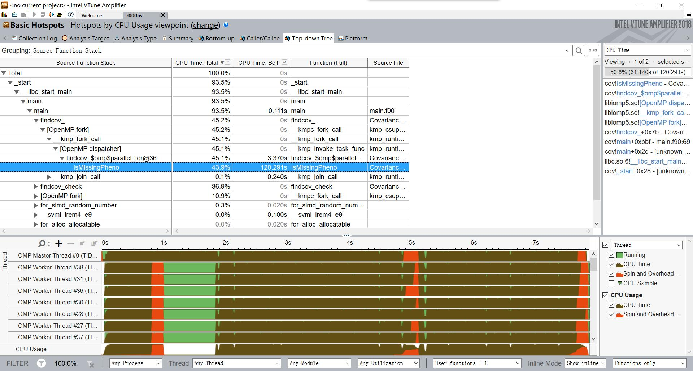
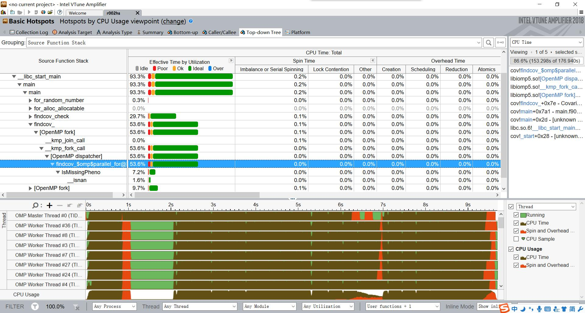
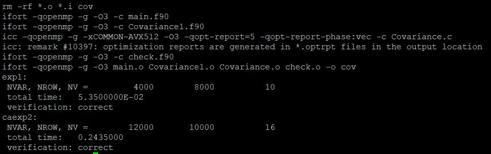

# covariance优化报告
## 1、编译运行代码
配置好icc和ifort编译器，进入exe文件夹，执行`sh benchmark.sh`命令编译运行，结果如下：
```
$ sh benchmark.sh
rm: cannot remove ‘cov’: No such file or directory
rm -rf *.o *.i cov
ifort -qopenmp -c main.f90
ifort -qopenmp -c Covariance1.f90
icc -qopenmp -c Covariance.c
ifort -qopenmp -c check.f90
ifort -qopenmp main.o Covariance1.o Covariance.o check.o -o cov
exp1:
rm: cannot remove ‘exp.ini’: No such file or directory
 NVAR, NROW, NV =         4000        8000          10
 total time:   0.4774000
 verification: correct
exp2:
 NVAR, NROW, NV =        12000       10000          16
 total time:    2.765900
 verification: correct
```
  
本着必须开启编译优化的原则，开启O3优化，并加上-g参数，方便后续调试：
```
$ sh benchmark.sh
rm -rf *.o *.i cov
ifort -qopenmp -c main.f90
ifort -qopenmp -c Covariance1.f90
icc -qopenmp -g -O3 -c Covariance.c
ifort -qopenmp -c check.f90
ifort -qopenmp main.o Covariance1.o Covariance.o check.o -o cov
exp1:
 NVAR, NROW, NV =         4000        8000          10
 total time:   0.5334000
 verification: correct
exp2:
 NVAR, NROW, NV =        12000       10000          16
 total time:    3.611400
 verification: correct
```
很迷啊，开了O3速度反而比不开慢。。。醉了，想了下一方面应该是执行时间过短，遇到系统波动，CPU睿频情况不同导致速度不同；另一方面，-g参数或许会影响执行效率。  
随后，重新测试多次，不开O3，加上-g参数，时间在7s左右。
```
$ sh benchmark.sh
rm -rf *.o *.i cov
ifort -qopenmp -c main.f90
ifort -qopenmp -c Covariance1.f90
icc -qopenmp -g -c Covariance.c
ifort -qopenmp -c check.f90
ifort -qopenmp main.o Covariance1.o Covariance.o check.o -o cov
exp1:
 NVAR, NROW, NV =         4000        8000          10
 total time:    1.266100
 verification: correct
exp2:
 NVAR, NROW, NV =        12000       10000          16
 total time:    7.043500
 verification: correct
```
另外，重新测试开启O3，不加-g参数，结果如下：
```
$ sh benchmark.sh
rm -rf *.o *.i cov
ifort -qopenmp -c main.f90
ifort -qopenmp -c Covariance1.f90
icc -qopenmp -O3 -c Covariance.c
ifort -qopenmp -c check.f90
ifort -qopenmp main.o Covariance1.o Covariance.o check.o -o cov
exp1:
 NVAR, NROW, NV =         4000        8000          10
 total time:   0.4462000
 verification: correct
exp2:
 NVAR, NROW, NV =        12000       10000          16
 total time:    2.963900
 verification: correct
```
虽然还是慢于第一次测试，不过已经相无几了，而且快于加上-g参数的测试，所以，该测试结果说明-g参数会对执行效率造成影响。但我对此结论存疑，一是-g只是生成debug信息，不应对执行代码有影响；另一方面，测试时间过短，易受CPU睿频影响，系统调度以及其他波动也会造成显著影响，所以该问题应保留下来，待日后有空继续分析。
## 2、通过Vtune分析代码执行情况
收集代码执行热点信息得到如下图所示的结果：  
  
按要求，需要优化的部分就是findcov这个函数。  
很明显可以看出，findcov占用整个程序执行接近50%的时间，如果能想办法降低它的执行时间，对于整个程序来说效率也是巨大的提升。  
注意到，IsMissPhone函数也占用了近44%的时间，于是便想到可以优化该函数，以及该函数调用的子函数isnan。
## 3、分析代码结构
1. 分析三重for循环重复部分  
由`I2 = (iv1 + iv2 + 1) % NVAR;`可看出I2是在NVAR范围内重复的，后续代码对数组的操作也是基于I2，所以可以考虑先对每一列进行处理，将结果保存下来，之后IsMissPhone操作时只需要访存预先处理好的结果就行，不用重复计算了。

2. 内联函数  
将所有调用的函数写在主函数里，避免C语言调用函数时压栈的巨大开销
3. 对于乘加浮点运算，使用AVX指令集加速
开启AVX512编译优化，并在代码有多个浮点计算的地方，手动加入编译指示，要求编译器向量化浮点运算。
## 3、尝试优化
本次优化代码见[这里](https://github.com/haswelliris/covariance/blob/371db1580bb2affd034980a44da71c8459a73bac/src/Covariance.c)  
根据vtune得到的结果，想改一改IsMissPhone里面的实现，以及把函数内联了，让它别占用太多时间。
主要改动如下：
1. 内联isnan函数
2. 内联IsMissPhone函数  

测试结果：
```
$ sh benchmark.sh
rm -rf *.o *.i cov
ifort -qopenmp -g -O3 -c main.f90
ifort -qopenmp -g -O3 -c Covariance1.f90
icc -qopenmp -g -O3  -c Covariance.c
ifort -qopenmp -g -O3 -c check.f90
ifort -qopenmp -g -O3 main.o Covariance1.o Covariance.o check.o -o cov
exp1:
 NVAR, NROW, NV =         4000        8000          10
out
 total time:   0.9389000
 verification: correct
exp2:
 NVAR, NROW, NV =        12000       10000          16
out
 total time:    5.721200
 verification: correct
```
5.72s，比优化之前的3s多差多了。。。。负优化，本次优化失败  
分析原因，其实IsMissPhone函数本身并没有占用太多时间，本来或许intel的库的实现很高效，我自己一改，导致效率反而降低。  
又找了一个只加了-g参数的vtune分析：  
  
结果IsMissPhone占用的时间是很少的。。。。应该是开启编译优化之后，输出的占用时间情况不准确导致输出的是错误的分析。

## 4、效果不佳的优化尝试
一开始分析提到，最内层循环对IsMissPhone的计算是重复的，一共重复了NV次。所以，想到可以预先对整个数组进行IsMissPhone处理，把结果保存在数组中，这样最内层循环就能快速判断，而不用进行IsMissPhone操作，从而是IsMissPhone的相对执行时间减少到原来的1/NV  
本次优化代码见[这里](https://github.com/haswelliris/covariance/blob/371db1580bb2affd034980a44da71c8459a73bac/src/Covariance.c)  
结果如下：  
```
$ sh benchmark.sh
rm -rf *.o *.i cov
ifort -qopenmp -g -O3 -c main.f90
ifort -qopenmp -g -O3 -c Covariance1.f90
icc -qopenmp -g -O3  -c Covariance.c
ifort -qopenmp -g -O3 -c check.f90
ifort -qopenmp -g -O3 main.o Covariance1.o Covariance.o check.o -o cov
exp1:
 NVAR, NROW, NV =         4000        8000          10
out
 total time:   0.7398000
 verification: correct
exp2:
 NVAR, NROW, NV =        12000       10000          16
out
 total time:    5.087400
 verification: correct
```
接近5s，比之前的5.72s要快一些，说明确实降低了IsMissPhone函数的开销，但因为IsMissPhone实际占整体实际并不大，最大的还是最内层循环的乘加运算，所以优化效果不佳。
## 5、AVX与向量化
既然乘加运算占用了大量实际，考虑到可以使用AVX指令加速浮点运算，于是便对编译器开启AVX支持，希望通过编译器自动调用avx寄存器，实现向量运算。  
本来试图用矩阵乘法，更方便高效的向量化，但是由于IsMissPhone这个if判断的存在，便不能的使用循环展开了，也不方便手动实现向量化。于是寄希望于编译器自动向量化，以及CPU执行时的分支预测地高效执行了。
Makefile改动如下：  
`CFLAGS= -qopenmp -g -xCOMMON-AVX512 -O3 -qopt-report=5 -qopt-report-phase:vec`  
测试如下：
```
$ sh benchmark.sh
rm -rf *.o *.i cov
ifort -qopenmp -g -O3 -c main.f90
ifort -qopenmp -g -O3 -c Covariance1.f90
icc -qopenmp -g -xCOMMON-AVX512 -O3 -qopt-report=5 -qopt-report-phase:vec -c Covariance.c
icc: remark #10397: optimization reports are generated in *.optrpt files in the output location
ifort -qopenmp -g -O3 -c check.f90
ifort -qopenmp -g -O3 main.o Covariance1.o Covariance.o check.o -o cov
exp1:
 NVAR, NROW, NV =         4000        8000          10
out
 total time:   0.6287000
 verification: correct
exp2:
 NVAR, NROW, NV =        12000       10000          16
out
 total time:    4.680400
 verification: correct
```
4.6s相对于上次的5s，还是有小小的提升（虽然也有可能是误差导致的），说明AVX指令有一定效果，至于O3是否已经开启了avx512，这个有待查证。
## 6、跨越——矩阵转置
考虑到内层循环每次对数组的访存都要进行一次乘法运算求得相对位置，因为内层循环访问的是二维数组的列，他们在内存不是连续的（二维数组的行元素是连续存储的），不能充分利用多级缓存预取，每次访问都需要到内存中读取，造成了巨大的内存访问开销。访问内存的延迟在70ns左右,而cpu每个指令执行时间不到1ns，这样会导致流水线严重阻塞。  
于是便想转置整个数组矩阵，也就是行列互换，这样相当于最外层循环访问的是列，最内层循环是行，这样内层循环中数组访问的乘法运算便没了，减少了计算量。而且行元素是连续的，每次从内存中读取能取附近很多个元素到缓存中，这样执行时几乎所有的元素都在CPU片上高速缓存，便可以充分利用超标量处理器的多发射填满流水线而且不会因为访存延迟导致阻塞。  
转置操作也用到openmp并行加速。  
具体实现代码见[这里](https://github.com/haswelliris/covariance/blob/0df2c39daf29a21f5162e6f5cf5adc0f86dd154b/src/Covariance.c)  
测试结果如下：
```
$ sh benchmark.sh
rm -rf *.o *.i cov
ifort -qopenmp -g -O3 -c main.f90
ifort -qopenmp -g -O3 -c Covariance1.f90
icc -qopenmp -g -xCOMMON-AVX512 -O3 -qopt-report=5 -qopt-report-phase:vec -c Covariance.c
icc: remark #10397: optimization reports are generated in *.optrpt files in the output location
ifort -qopenmp -g -O3 -c check.f90
ifort -qopenmp -g -O3 main.o Covariance1.o Covariance.o check.o -o cov
exp1:
 NVAR, NROW, NV =         4000        8000          10
 total time:   5.3500000E-02
 verification: correct
caexp2:
 NVAR, NROW, NV =        12000       10000          16
 total time:   0.2435000
 verification: correct
```
0.24s快得令人窒息，执行时间降低了整整两个数量级。
## 7、总结
前几次优化，基本都是负优化。这是因为没有准确的找到耗时过多的部分，以及性能瓶颈所在。之后以CPU多级缓存访存策略为入口，找到最内层循环中每次数组操作可能导致巨大访存开销，通过矩阵转置，使得CPU访存策略能够提前预取相邻内存，从而提高了访存效率，执行时流水线不再因等待内存数据而阻塞，从而消除了性能瓶颈，大大减少了执行时间。  
最后附上最终执行结果图：

